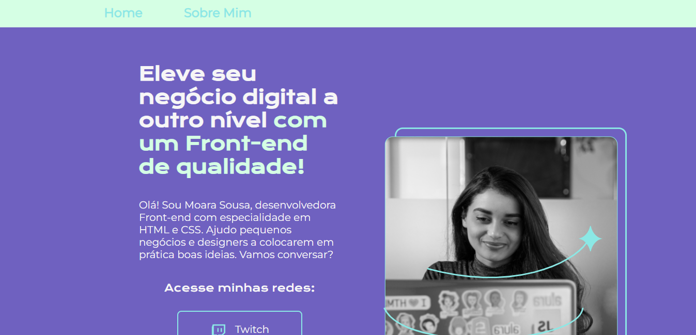

## Project 

Project challenge
In this repository, you will find a variety of projects that encompass different areas, including web development, design, etc. This project not only showcases my technical skills but also my creative approach.

## Features
* HTML Resources:
Semantic Structure: Utilization of semantic elements such as header, nav, main, article, section, and <footer to enhance the structure and accessibility of the website.
Navigation: Incorporation of a navigation menu within the header (header), containing links to both the home page (index.html) and the "Sobre Mim" page (about.html).
Main Content: Implementation of the main element to encapsulate the primary content of the webpage.
Sections and Headings: Division of content into distinct sections (section), each marked with appropriate headings h1, facilitating a clear content hierarchy.
Images: Embedding of images (img) to visually illustrate the content, including an image depicting a woman working with a notebook.
External Links: Addition of external links through the use of the <a element, linking to social media platforms (Twitch, Github, LinkedIn).
Highlighted Text: Application of the strong tag to emphasize specific portions within titles.
* CSS Resources:
Custom Fonts: Integration and application of custom fonts from Google Fonts for both titles and text.
Custom Colors: Definition of CSS variables (--primary-color, --secondary-color, etc.) to store color values and simplify color scheme adjustments.
Box Sizing: Implementation of the box-sizing property: border-box; to enhance management of element spacing.
Flexible Layout: Utilization of flexbox for alignment and distribution of elements within the header, main content, and footer.
Responsive Layout: Establishment of a media query rule to adapt the layout for devices with a maximum width of 1200px.
Styled Links: Application of styles to links (a) to create stylized buttons with rounded borders.
Margins and Padding: Utilization of margins and padding to ensure proper spacing and layout.
Header and Footer Styles: Specification of distinct styles for the header (header) and footer (footer).
Responsiveness: Adjustments to the layout and fonts to ensure an optimal experience on mobile devices.

This project is licensed under the https://project-challenge-eight.vercel.app/. Check out!
